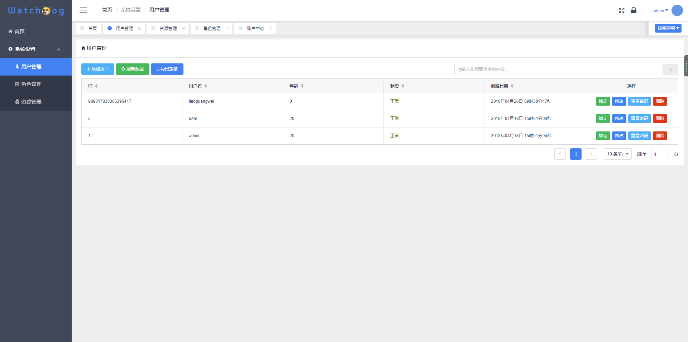
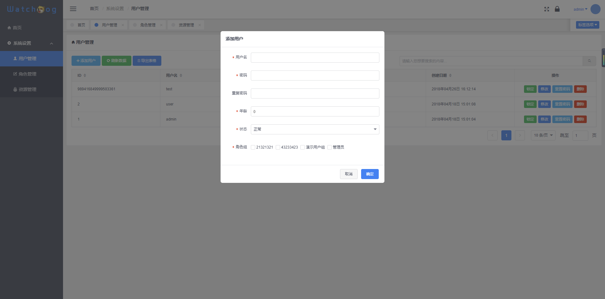
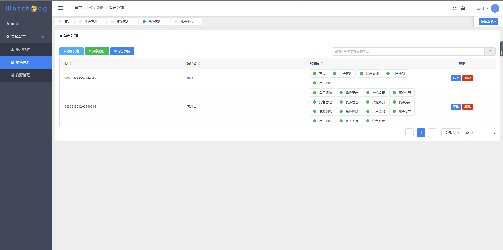
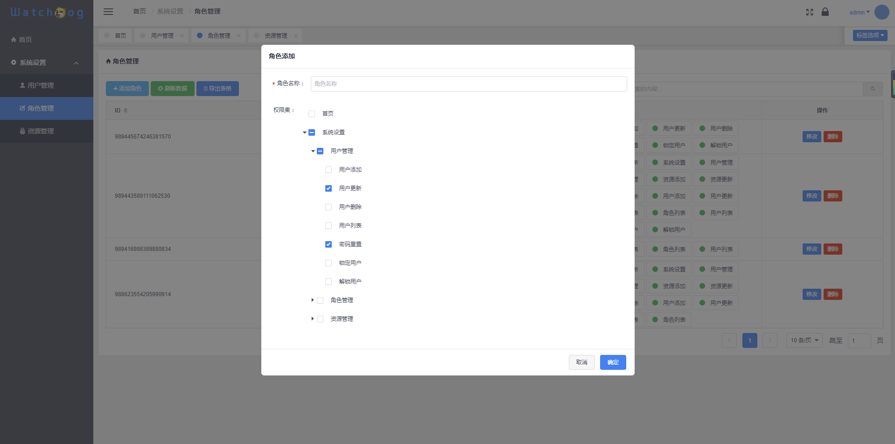
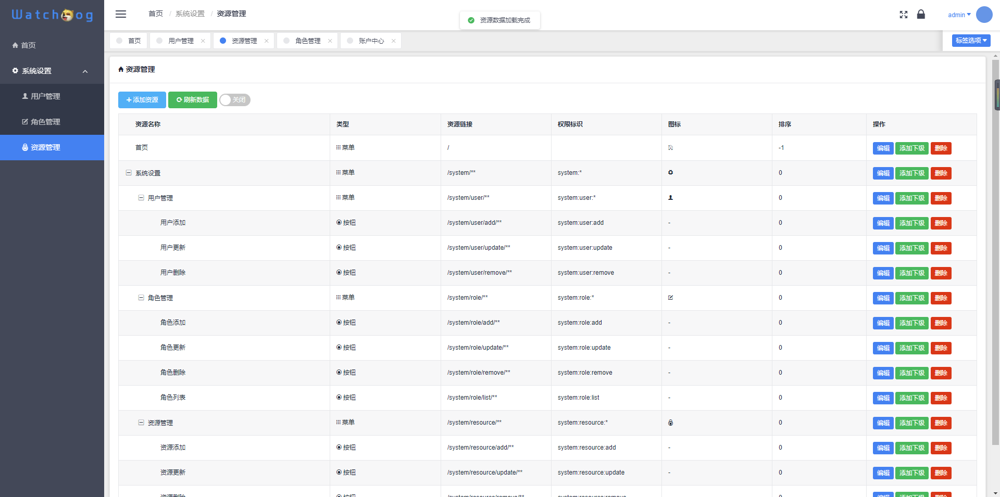
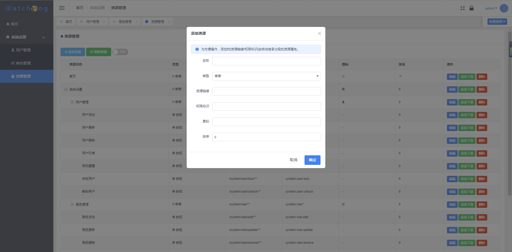

#### boot-dog：最简洁易上手的前后端分离后台管理系统
```
boot-dog前身watchdog-framework，原地址https://github.com/watchdog-framework/watchdog-framework
    Spring Boot to 2.1.6
    Mybatis-Plus to 3.3.2
    Shiro to 1.5.3
    Jedis to Lettuce
    HikariCP to Druid
    ...
```

# 介绍
`boot-dog`基于SpringBoot+Shiro+Mybatis-Plus+Druid+Redis+JWT+Vue+iView等开发的轻量级管理系统快速开发脚手架，拥有角色、用户、资源管理、权限数据同步更新等功能，并此项目会进行持续更新升级，欢迎使用，若对您有帮助请点击上方的star :beers: 。

# 部分界面展示

## 登录

## 用户管理

## 用户管理

## 用户添加
 
## 角色管理
 
## 角色添加
 
## 资源管理
 
## 资源添加
    
## 更多请查看上方演示
# 技术选型
## 后端技术
技术 | 类型 | 版本 | 官网
----|------|----|----
Spring Boot | 容器 | 2.1.6.RELEASE | [http://start.spring.io/](http://start.spring.io/)
Mybatis-Plus | ORM框架 | 3.3.2 |  [http://mp.baomidou.com/](http://mp.baomidou.com/)
Maven | 项目构建管理 | 3.6 |  [http://maven.apache.org](http://maven.apache.org/)
Apache Shiro | 安全框架 | 1.5.3 |  [http://shiro.apache.org](http://www.mybatis.org/generator/index.html)
Lombok | 工具 | 1.18.12 |  [https://www.projectlombok.org/](https://www.projectlombok.org/)
Druid | 阿里巴巴数据库连接池 | 1.1.23 |  [https://github.com/alibaba/druid/](https://github.com/alibaba/druid/)
Shiro-Redis | shiro缓存工具 | 2.8.24 | [https://github.com/alexxiyang/shiro-redis](https://github.com/alexxiyang/shiro-redis)
Springfox-Swagger2 | api文档工具 | 2.9.2 | [https://github.com/springfox/springfox](https://github.com/springfox/springfox)
jwt | 身份认证 | 3.10.3 | [https://jwt.io/](https://jwt.io/)
## 前端技术
技术 | 类型 | 版本 | 官网
----|------|----|----
Vue | 前端渐进式框架 | 2.5.13 | [https://cn.vuejs.org/](https://cn.vuejs.org/)
Vue-Router | 前端路由 | 3.0.1 | [https://router.vuejs.org/](https://router.vuejs.org/)
Vuex | 前端状态管理 | 3.0.1 | [https://vuex.vuejs.org/](https://vuex.vuejs.org/)
Axios | HTTP库 | 0.18.0 | [https://github.com/axios/axios](https://github.com/axios/axios)
iView | UI框架 | 2.8.0 | [https://www.iviewui.com/](https://www.iviewui.com/)
dayjs | JS时间操作库 | 1.5.14 | [https://github.com/xx45/dayjs](https://github.com/xx45/dayjs)
String-Format | 字符串格式化 | 1.0.0 | [https://github.com/davidchambers/string-format](https://github.com/davidchambers/string-format)
Vue-table-with-tree-grid | iview-树表格 | 0.2.4 | [https://github.com/MisterTaki/vue-table-with-tree-grid](https://github.com/MisterTaki/vue-table-with-tree-grid)
js-md5 | js-md5库 | 0.7.3 | [https://github.com/emn178/js-md5](https://github.com/emn178/js-md5)

# 使用方法
## 软件需求
    JDK1.8+
    MySQL5.6+
    Maven3.6
## 服务端
- 使用前提：安装lombok插件
   
   - IDEA安装方法：[https://blog.csdn.net/zhglance/article/details/54931430](https://blog.csdn.net/zhglance/article/details/54931430)
   - eclipse安装方法：[https://blog.csdn.net/dorothy1224/article/details/79280591/](https://blog.csdn.net/dorothy1224/article/details/79280591/)
- 克隆到本地
```git
git clone https://github.com/ruiyeclub/boot-dog.git
```
- 导入SQL

    将resources/sql目录下的`bdog.sql`导入至数据库信息
    > admin默认密码为：123456
- 修改数据库信息
```yml
# application.yml
spring:
  datasource:
    url: jdbc:mysql://localhost:3306/bdog?useUnicode=true&characterEncoding=utf-8&serverTimezone=Asia/Shanghai
    password: root
    username: root
    driver-class-name: com.mysql.cj.jdbc.Driver
```
- 启动
    
    运行`BootDogApplication.java`，默认端口为1000
    
# 项目地址

- Github：[https://github.com/ruiyeclub/boot-dog](https://github.com/ruiyeclub/boot-dog)

# TODO

- [ ] 支持容器化
- [ ] 字典
- [ ] 七牛云
- [ ] More...

# 开源协议
MIT
    
